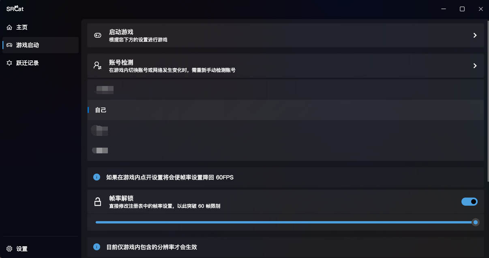
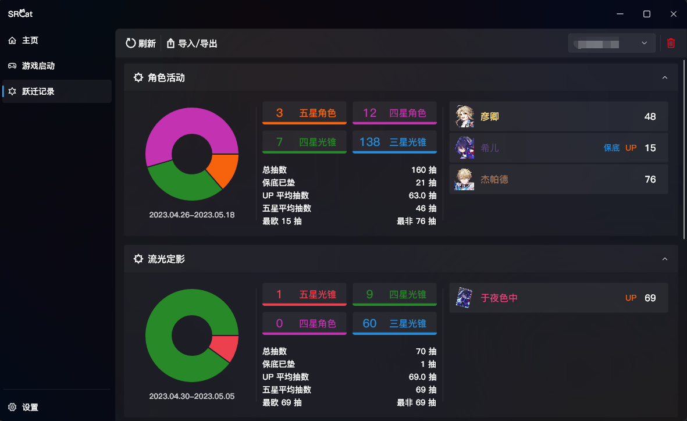

<h1 align="center" size="80">SRCat</h1>

崩坏：星穹铁道 - 工具箱 / 愿此行，有猫猫一直相伴

> **SRCat 开发中，并非完全体，可能存在许多奇怪的 BUG (￣﹃￣)**

## 使用说明
1. 前往 [Releases](https://github.com/BoxCatTeam/SRCat/releases) 下载最新版
2. 解压缩到任意目录
3. 双击 `srcat.exe` 启动 SRCat，第一次启动可能稍微有点慢 (需要下载部分资源)
4. 根据 SRCat 的指引选择 `StarRail` 的启动 `exe` 文件（`游戏安装目录/Game/StarRail.exe`）
5. 请启动一次游戏，并进入跃迁页面，打开一次跃迁记录的页面，然后回到 `SRCat` 主程序内，点击侧栏的 `跃迁记录`，根据提示刷新跃迁记录

## 当前版本截图
  
  

## 计划
- [x] 游戏启动器
    - [x] 帧率解锁
    - [x] 多账号切换
- [ ] 跃迁记录
    - [x] 多账号支持
    - [x] 数据导入/导出 (请注意：导入的数据需要严格遵循 [SRGF](https://uigf.org/zh/standards/SRGF.html) 才能正常导入)
    - [ ] 以 `代理模式`、`SToken` 刷新跃迁记录
    - [x] 保底计算
    - [x] 光锥基本数据补全
- [ ] 设置
    - [x] 主题
    - [ ] 多语言支持
    - [x] 背景材质切换

还有更多功能正在逐步咕咕中...

## 特别感谢
- [UIGF](https://uigf.org/)
### 参考项目
- [xunkong/xunkong](https://github.com/xunkong/xunkong)
- [DGP-Studio/Snap.Hutao](https://github.com/DGP-Studio/Snap.Hutao)
- [DGP-Studio/Snap.Genshin](https://github.com/DGP-Studio/Snap.Genshin)

### 技术栈
- [dart](https://github.com/dart-lang/sdk)
- [flutter/flutter](https://github.com/flutter/flutter)

## 活跃数据

## License
Copyright © 2023 [BoxCatTeam](https://boxcat.org), under MIT License
